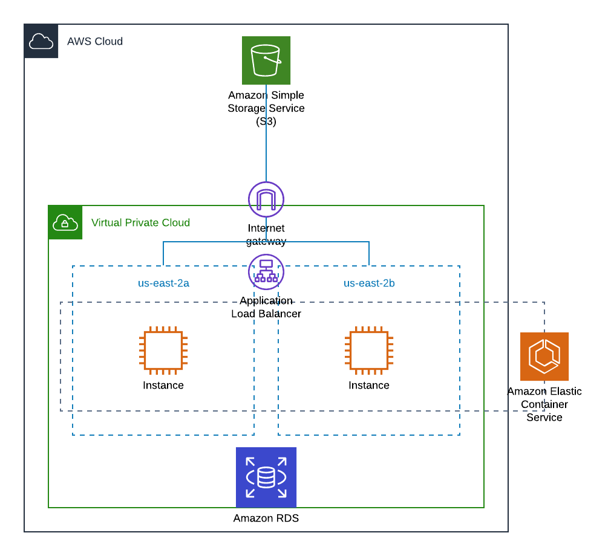

# RampUp 2020: Pizza application

Pizza application in React and deploy in AWS S3 Bucket.

## Architecture



Only for the application frontend, a S3 bucket will be deploy it. The application backend is located [here](https://github.com/mnl359/pizzas-back/tree/master)

## Software requirements

To run this application without CI/CD tool, the software needed is:

- NPM
- terraform

Also, a AWS and CircleCI account are required.

## Deploy

1. You need to create a S3 bucket and a DynamoDB table to store the terraform state. Also, change the following variables in the [state_config.tf](terraform/state-config.tf):

| Line | Variable | Description |
| ---- | -------- | ----------- |
| 3    | bucket   | Your bucket name |
| 4    | key      | Path to the state file in the bucket |
| 6    | dynamodb_table | Table to store the terraform Lock |

1. Change the projects [variables](terraform/variables.tf)

| Line | Variable | Description |
| ---- | -------- | ----------- |
| 1    | profile  | AWS profile to execute the terraform |
| 14   | tags     | Adjust the tags for your needs |
| 23   | s3_name  | Bucket name |

### Manual

1. Install the node modules.
```sh
npm i
```

---
**NOTE**

You can launch the test runner with:

```sh
npm test
```

Also, you can run the app in the development mode:

http://localhost:3000

```sh
npm start
```

---


2. Set the API endpoint into .env
```sh
echo "REACT_APP_API_URL=$BACKEND_API_ENV" >> .env
```

3. Build it.
```sh
npm run build
```

4. Enter to the terraform directory and run the following commands:

```sh
# Initialize terraform
terraform init
# Infrastructure checkout
terraform plan
# Infrastructure deploy
terraform apply
```

5. Upload the builded frontend to the bucket
```sh

aws s3 sync . s3://<bucket name>
```

### Pipeline

